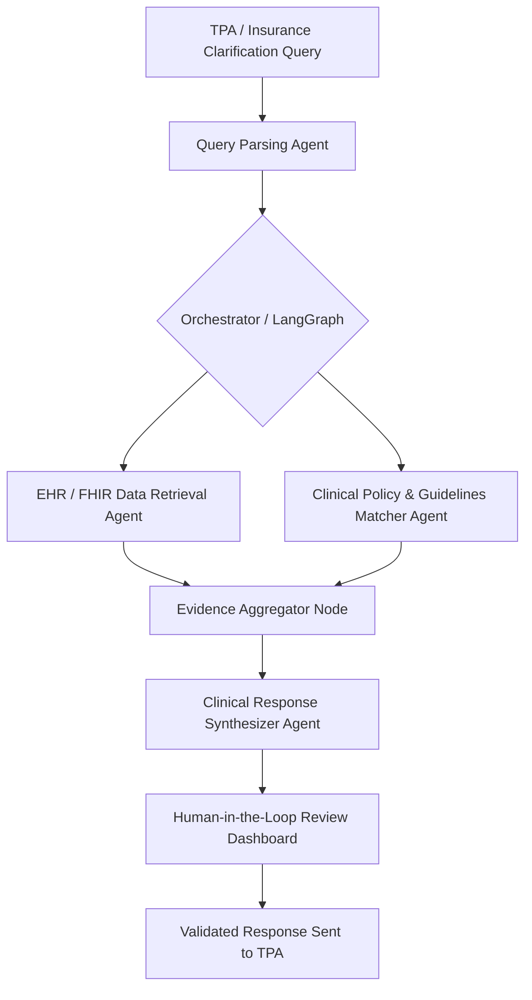

# ClaimStream Architecture Overview

ClaimStream is an AI-powered multi-agent clinical clarification desk designed to streamline how hospitals and healthcare providers handle insurance and Third-Party Administrator (TPA) queries.

---

## 1. Problem Statement
When healthcare providers submit claims to TPAs and health insurers, claims frequently encounter clarification requests (queries regarding medical necessity, missing documentation, diagnosis-procedure discrepancies, or policy specificities). 

Manual clarification workflows cause:
- Significant delays in revenue cycle management (RCM).
- Administrative burnout for clinicians and billing teams.
- Higher denial rates due to missed deadlines or incomplete documentation.

---

## 2. Core Solution: Multi-Agent Clinical Clarification Desk
ClaimStream automates the analysis, retrieval, validation, and draft response synthesis for clarification requests using an orchestrated multi-agent system.

---

## 3. System Architecture & Modules

### Frontend (`/frontend`)
- **Next.js (App Router, TypeScript, Tailwind CSS)**:
  - Provider & Biller Dashboard.
  - Clarification Queue & Status Tracking.
  - Multi-Agent Step Trace & Clinical Evidence Visualizer.
  - Draft Response Review & One-Click Submission.

### Backend (`/backend`)
- **FastAPI Core (`backend/app/main.py`)**:
  - High-performance RESTful API.
  - Modular routing for claims, clarification queries, and agent triggers.
- **Agents (`backend/app/agents/`)**:
  - `query_parser`: Extracts structured inquiry points, patient IDs, claim IDs, and missing document requirements.
  - `record_extractor`: Queries synthetic EHR/FHIR patient data for clinical evidence.
  - `policy_matcher`: Correlates requested criteria with standard insurance policies and medical necessity rules.
  - `response_generator`: Generates formal, compliant clarification responses citing exact clinical records.
- **Graph (`backend/app/graph/`)**:
  - State management and multi-agent workflow orchestration via LangGraph.
- **Models (`backend/app/models/`)**:
  - Pydantic schemas and database models for claims, queries, agents, and clinical records.
- **Data (`backend/app/data/`)**:
  - Synthetic FHIR / EHR datasets and sample TPA queries for hackathon demos and testing.

---

## 4. Planned Tech Integrations
- **Orchestration**: LangGraph
- **LLM Provider**: Gemini 1.5 / 2.0 or compatible provider
- **Storage**: SQLite for fast hackathon MVP setup
- **Clinical Standards**: Synthetic FHIR JSON resources (Patient, Encounter, Condition, Procedure, Observation)
